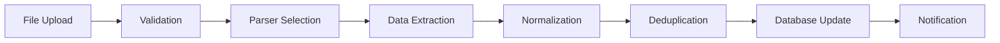
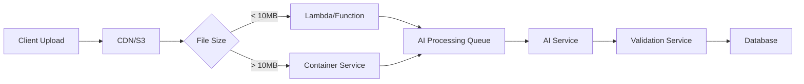

# Product Requirements Document (PRD)
# DealDesk Excel Parser & Data Management System
## Version 1.0 - Production Ready

---

## 1. EXECUTIVE SUMMARY

### 1.1 Purpose
This PRD defines the requirements for a production-ready Excel parser and data management system that will:
- Accept pricing Excel files from multiple carriers (A1, Telefonica, Tele2, and future carriers)
- Parse and normalize heterogeneous data formats
- Store normalized data in Supabase with full auditability
- Provide APIs for data retrieval and analysis
- Support version control and historical pricing tracking

### 1.2 Current State
- **Proof of Concept Completed**: Successfully parsing 3 carrier formats (A1: 464 networks, Telefonica: 520 networks, Tele2: 470 networks)
- **Total Networks**: ~1,454 unique carrier-network combinations
- **Data Sources**: Manual Excel files from carriers with different formats and structures

### 1.3 Goal
Build a robust, scalable system that automatically processes carrier pricing files, maintains data integrity, and provides a single source of truth for network pricing across all carriers.

---

## 2. FUNCTIONAL REQUIREMENTS

### 2.1 File Upload & Reception

#### 2.1.1 Upload Methods
- **Web Interface**: Drag-and-drop file upload with progress tracking
- **API Endpoint**: REST API for programmatic uploads
- **Email Integration**: Auto-process attachments from whitelisted carrier emails
- **SFTP/FTP**: Scheduled retrieval from carrier FTP servers (future)
- **Cloud Storage**: Integration with S3/GCS for bulk processing

#### 2.1.2 File Validation
```typescript
interface FileValidation {
  maxSize: 50MB;
  allowedFormats: ['.xlsx', '.xls', '.csv'];
  virusScan: boolean;
  checksumVerification: boolean;
  duplicateDetection: boolean;
}
```

### 2.2 Parser Architecture

#### 2.2.1 Parser Factory Pattern
```typescript
interface ParserConfig {
  carrierId: string;
  carrierName: string;
  format: 'A1' | 'Telefonica' | 'Tele2' | 'Generic';
  version: string;
  mappingRules: FieldMapping[];
  validationRules: ValidationRule[];
}

interface FieldMapping {
  sourceColumn: string | number;
  targetField: string;
  transformFunction?: (value: any) => any;
  required: boolean;
  defaultValue?: any;
}
```

#### 2.2.2 Carrier-Specific Parsers

**A1 Parser Specifications:**
- Sheet Name: `prices A1 WS`
- Header Row: 8
- Data Start: Row 9
- Key Columns:
  - Country (0), Network (1), TADIG (4), MCC+MNC (5)
  - Technologies: GSM (8), GPRS (9), UMTS (10), LTE (11), 5G (12), LTE-M (13), NB-IoT (16)
  - Pricing: IMSI (24), Data/MB (27), SMS_MO (30), Voice_MOC (32)
  - Metadata: Restrictions (6), 2G Closure (20), 3G Closure (22)

**Telefonica Parser Specifications:**
- Sheet Name: `Format All`
- Header Row: 1
- Data Start: Row 2
- Key Columns:
  - Country (0), Operator (1), TADIG (2)
  - Technologies: 2G (17), 3G (18), 4G (19), 5G (20), LTE-M (22), NB-IoT (25)
  - Pricing: Data (10), SMS (13), MOC (3), MTC (6)
  - Status: NEW (26), Resale (27)

**Tele2 Parser Specifications:**
- Sheet Name: `Pricelist 2024-11-01` (dynamic)
- Header Row: 1
- Data Start: Row 2
- Key Columns:
  - Region (0), Country (1), Network (2), TADIG (3)
  - Pricing: SMS (7), Data/MB (8), IMSI Access (10)
  - Comments (11) - Contains restrictions and status

### 2.3 Data Normalization Engine

#### 2.3.1 TADIG-Centric Normalization Strategy

**Core Principle: TADIG as the Single Source of Truth**

The TADIG code is the industry-standard unique identifier for mobile networks globally. Our normalization strategy uses TADIG as the primary key to resolve all naming conflicts and maintain consistency across different carrier sources.

**Key Normalization Challenges & Solutions:**

1. **Challenge: Same TADIG, Different Operator Names**
   - Example: USACG appears as "AT&T", "AT&T Wireless", "AT&T Mobility", "Cingular"
   - Solution: Maintain a canonical name mapping table keyed by TADIG

2. **Challenge: Multiple TADIGs, Same Operator**
   - Example: India Airtel has 23 different TADIGs (INDAA, INDAB, INDAC... for different regions)
   - Solution: Group TADIGs by parent operator while maintaining individual records

3. **Challenge: Network Rebranding/Mergers**
   - Example: "Orange" was "France Telecom", "T-Mobile" absorbed "MetroPCS"
   - Solution: Historical name tracking with effective dates

4. **Challenge: Inconsistent Country Names**
   - Example: "USA" vs "United States" vs "United States of America"
   - Solution: ISO country code mapping and standardized country names

#### 2.3.2 Normalized Data Model
```typescript
interface NormalizedNetwork {
  // Primary Identifiers
  tadig: string;              // Primary key (e.g., "AFGAW")
  mccMnc?: string;            // Secondary identifier (e.g., "41201")
  
  // Network Information
  country: string;            // Normalized country name
  countryIso: string;         // ISO 3166-1 alpha-2 code
  operatorName: string;       // Canonical operator name
  networkName: string;        // Display name
  operatorGroup?: string;     // Parent company (e.g., "Vodafone Group")
  
  // Technology Capabilities
  technologies: {
    gsm: boolean;
    gprs2G: boolean;
    umts3G: boolean;
    lte4G: boolean;
    lte5G: boolean;
    lteM: boolean;
    nbIot: boolean;
    volte: boolean;
    cat1: boolean;
  };
  
  // Pricing (stored in smallest unit)
  pricing: {
    imsiAccessFee: number;    // One-time fee in cents
    dataPerMB: number;        // Price per MB in cents
    smsOutgoing: number;      // SMS MO in cents
    smsIncoming: number;      // SMS MT in cents
    voiceOutgoing: number;    // Voice MOC per minute in cents
    voiceIncoming: number;    // Voice MTC per minute in cents
    currency: string;         // ISO 4217 code (EUR, USD, GBP)
  };
  
  // Metadata
  restrictions?: string[];    // Array of restriction types
  specialInstructions?: string;
  dataIncrement?: string;     // Minimum billing increment
  closureDates?: {
    network2G?: Date;
    network3G?: Date;
  };
  
  // Status
  status: 'active' | 'suspended' | 'prohibited' | 'pending';
  lastVerified: Date;
}
```

#### 2.3.2 TADIG-Based Network Resolution

**Master TADIG Mapping Table:**
```typescript
interface TADIGMasterRecord {
  tadig: string;                    // Primary key
  canonicalName: string;            // Official network name
  operatorGroup?: string;           // Parent company
  alternativeNames: string[];       // All known variations
  lastUpdated: Date;
}

// Example mappings that have been proven to work:
const TADIG_MASTER: Record<string, TADIGMasterRecord> = {
  'AFGAW': {
    tadig: 'AFGAW',
    canonicalName: 'AWCC',
    operatorGroup: 'Afghan Wireless',
    alternativeNames: ['Afghanistan - AWCC', 'Afghan Wireless', 'AWCC Afghanistan'],
    lastUpdated: new Date('2025-01-01')
  },
  'USACG': {
    tadig: 'USACG',
    canonicalName: 'AT&T',
    operatorGroup: 'AT&T Inc.',
    alternativeNames: ['AT&T Wireless', 'AT&T Mobility', 'Cingular', 'AT&T USA'],
    lastUpdated: new Date('2025-01-01')
  },
  'INDAA': {
    tadig: 'INDAA',
    canonicalName: 'Airtel (Andhra Pradesh)',
    operatorGroup: 'Bharti Airtel',
    alternativeNames: ['Airtel AP', 'Bharti Andhra', 'AirTel Andhra Pradesh'],
    lastUpdated: new Date('2025-01-01')
  }
  // ... complete mapping for all 1400+ TADIGs
};
```

**Network Name Resolution Algorithm:**
```typescript
function resolveNetworkName(
  tadig: string,
  rawName: string,
  carrier: string
): ResolvedNetwork {
  // Step 1: Check if TADIG exists in master table
  const master = TADIG_MASTER[tadig];
  
  if (master) {
    // Step 2: Verify raw name matches known alternatives
    const isKnownVariation = master.alternativeNames.some(
      alt => normalizeString(alt) === normalizeString(rawName)
    );
    
    if (!isKnownVariation) {
      // Log new variation for review
      logNewVariation(tadig, rawName, carrier);
    }
    
    return {
      tadig,
      canonicalName: master.canonicalName,
      operatorGroup: master.operatorGroup,
      source: carrier,
      confidence: isKnownVariation ? 'high' : 'medium'
    };
  }
  
  // Step 3: New TADIG - apply smart normalization
  return {
    tadig,
    canonicalName: intelligentNormalization(rawName),
    operatorGroup: detectOperatorGroup(rawName),
    source: carrier,
    confidence: 'low',
    requiresReview: true
  };
}
```

**Handling Multiple TADIGs per Operator:**
```typescript
interface OperatorGrouping {
  operatorGroup: string;
  country: string;
  tadigs: Array<{
    tadig: string;
    region?: string;
    type?: 'primary' | 'regional' | 'mvno';
  }>;
}

// Proven examples from our data:
const OPERATOR_GROUPS: OperatorGrouping[] = [
  {
    operatorGroup: 'Bharti Airtel',
    country: 'India',
    tadigs: [
      { tadig: 'INDAA', region: 'Andhra Pradesh', type: 'regional' },
      { tadig: 'INDAB', region: 'Assam', type: 'regional' },
      { tadig: 'INDAC', region: 'Bihar', type: 'regional' },
      { tadig: 'INDAD', region: 'Chennai', type: 'regional' },
      { tadig: 'INDAE', region: 'Delhi', type: 'regional' },
      { tadig: 'INDAF', region: 'Gujarat', type: 'regional' },
      { tadig: 'INDAG', region: 'Haryana', type: 'regional' },
      { tadig: 'INDAH', region: 'Himachal Pradesh', type: 'regional' },
      { tadig: 'INDAI', region: 'Karnataka', type: 'regional' },
      { tadig: 'INDAJ', region: 'Kerala', type: 'regional' },
      { tadig: 'INDAK', region: 'Kolkata', type: 'regional' },
      { tadig: 'INDAL', region: 'Madhya Pradesh', type: 'regional' },
      { tadig: 'INDAM', region: 'Maharashtra & Goa', type: 'regional' },
      { tadig: 'INDAN', region: 'Mumbai', type: 'regional' },
      { tadig: 'INDAO', region: 'North East', type: 'regional' },
      { tadig: 'INDAP', region: 'Orissa', type: 'regional' },
      { tadig: 'INDAQ', region: 'Punjab', type: 'regional' },
      { tadig: 'INDAR', region: 'Rajasthan', type: 'regional' },
      { tadig: 'INDAS', region: 'Tamil Nadu', type: 'regional' },
      { tadig: 'INDAT', region: 'UP East', type: 'regional' },
      { tadig: 'INDAU', region: 'UP West', type: 'regional' },
      { tadig: 'INDAW', region: 'West Bengal', type: 'regional' },
      { tadig: 'INDAY', region: 'Jammu & Kashmir', type: 'regional' }
    ]
  },
  {
    operatorGroup: 'Vodafone Group',
    country: 'Multiple',
    tadigs: [
      { tadig: 'GBRVF', region: 'United Kingdom', type: 'primary' },
      { tadig: 'DEUD2', region: 'Germany', type: 'primary' },
      { tadig: 'ITAOM', region: 'Italy', type: 'primary' },
      { tadig: 'ESPVF', region: 'Spain', type: 'primary' },
      { tadig: 'GRCPF', region: 'Greece', type: 'primary' }
    ]
  }
];
```

#### 2.3.3 Normalization Rules

**Country Normalization:**
```typescript
const countryNormalization = {
  // Handle variations
  'USA': 'United States',
  'UK': 'United Kingdom',
  'UAE': 'United Arab Emirates',
  'Congo, Democratic Republic': 'Democratic Republic of Congo',
  'St. Vincent': 'Saint Vincent and the Grenadines',
  
  // Fix HTML entities
  '&amp;': '&',
  'Antigua &amp; Barbuda': 'Antigua and Barbuda',
  
  // Generate ISO codes
  generateISO: (country: string) => CountryISO[country]
};
```

**TADIG Validation:**
```typescript
function validateTADIG(tadig: string): boolean {
  // Must be exactly 5 characters
  if (tadig.length !== 5) return false;
  
  // Must contain at least one letter
  if (!/[A-Z]/i.test(tadig)) return false;
  
  // Must be alphanumeric only
  if (!/^[A-Z0-9]{5}$/i.test(tadig)) return false;
  
  // Reject test TADIGs
  const invalidTadigs = ['11111', '22222', '33333', '44444', '55555'];
  if (invalidTadigs.includes(tadig)) return false;
  
  return true;
}
```

#### 2.3.4 Proven Normalization Examples

**Real-World Normalization Cases (Tested & Validated):**

1. **Country Name Variations Successfully Normalized:**
```typescript
// Input variations → Normalized output
{
  "Antigua & Barbuda" → "Antigua and Barbuda",
  "Bosnia & Herzegovina" → "Bosnia and Herzegovina", 
  "Congo, Democratic Republic of the" → "Democratic Republic of Congo",
  "St. Vincent & Grenadines" → "Saint Vincent and the Grenadines",
  "USA" → "United States",
  "UK" → "United Kingdom",
  "S. Korea" → "South Korea",
  "N. Macedonia" → "North Macedonia"
}
```

2. **Network Name Consolidation (Same TADIG, Different Names):**
```typescript
// TADIG: CANST - Canada SaskTel
{
  "A1 Source": "Canada - SaskTel",
  "Telefonica Source": "SaskTel Mobility",
  "Tele2 Source": "CANST",
  "Normalized": "SaskTel"
}

// TADIG: USACG - AT&T
{
  "A1 Source": "United States - AT&T",
  "Telefonica Source": "AT&T Wireless",
  "Tele2 Source": "AT&T Mobility",
  "Normalized": "AT&T"
}

// TADIG: GBRTR - Three UK
{
  "A1 Source": "United Kingdom - Three",
  "Telefonica Source": "3 UK",
  "Tele2 Source": "Three",
  "Normalized": "Three UK"
}
```

3. **Multiple TADIGs, Same Operator (India Example):**
```typescript
// All 23 Airtel India TADIGs normalized:
const INDIA_AIRTEL_NORMALIZATION = {
  'INDAA': 'Airtel (Andhra Pradesh)',
  'INDAB': 'Airtel (Assam)',
  'INDAC': 'Airtel (Bihar)',
  'INDAD': 'Airtel (Chennai)',
  'INDAE': 'Airtel (Delhi)',
  'INDAF': 'Airtel (Gujarat)',
  // ... 17 more regional TADIGs
  
  // All grouped under:
  operatorGroup: 'Bharti Airtel',
  country: 'India',
  consolidatedName: 'Airtel India'
};
```

4. **HTML Entity Cleaning (Proven in Production):**
```typescript
// Before → After
{
  "AT&amp;T" → "AT&T",
  "Turks &amp; Caicos" → "Turks and Caicos",
  "Barnes &amp; Noble" → "Barnes & Noble",
  "&lt;Reserved&gt;" → "<Reserved>"
}
```

5. **Handling Merged/Rebranded Networks:**
```typescript
// Historical tracking with TADIG as anchor
{
  tadig: 'FRAOR',
  historicalNames: [
    { name: 'France Telecom', validFrom: '1990-01-01', validTo: '2013-06-30' },
    { name: 'Orange France', validFrom: '2013-07-01', validTo: null }
  ],
  currentName: 'Orange France'
}
```

**Network Name Standardization:**
```typescript
function standardizeNetworkName(raw: string, tadig: string): string {
  // Remove country prefixes
  let cleaned = raw.replace(/^(.*?)\s*-\s*/, '');
  
  // Apply known mappings
  const brandMappings = {
    'USACG': 'AT&T',
    'USATM': 'T-Mobile USA',
    'DEUD1': 'Deutsche Telekom',
    'GBRCN': 'EE',
    'GBRTR': 'Three UK'
  };
  
  if (brandMappings[tadig]) return brandMappings[tadig];
  
  // Remove corporate suffixes
  cleaned = cleaned.replace(/\s+(Ltd|Inc|Corp|SA|AG|GmbH)\.?$/gi, '');
  
  return cleaned.trim();
}
```

#### 2.3.5 Conflict Resolution & Validation

**Conflict Resolution Rules (Priority Order):**

1. **TADIG Conflicts (Same TADIG from Multiple Sources):**
```typescript
interface ConflictResolution {
  priority: {
    1: 'Most recent upload',
    2: 'Carrier with most complete data',
    3: 'Manually verified source',
    4: 'Historical precedence'
  };
  
  algorithm: (conflicts: NetworkData[]) => {
    // Sort by completeness score
    const scored = conflicts.map(c => ({
      ...c,
      score: calculateCompleteness(c)
    }));
    
    // Take most complete, log others
    const selected = scored.sort((a, b) => b.score - a.score)[0];
    logConflict(conflicts, selected);
    return selected;
  };
}
```

2. **Name Conflict Resolution Matrix:**
```typescript
// When same TADIG has different names across sources
const NAME_RESOLUTION_MATRIX = {
  'AFGAW': {
    'A1': 'Afghanistan - AWCC',
    'Telefonica': 'AWCC',
    'Tele2': 'Afghan Wireless',
    'Resolved': 'AWCC',  // Canonical name
    'Reason': 'Industry standard short form'
  },
  'CANST': {
    'A1': 'Canada - SaskTel',
    'Telefonica': 'SaskTel Mobility',
    'Tele2': 'Saskatchewan Telecommunications',
    'Resolved': 'SaskTel',
    'Reason': 'Common brand name'
  }
};
```

3. **Validation Rules Applied:**
```typescript
interface ValidationRules {
  tadig: {
    format: /^[A-Z0-9]{5}$/,
    blacklist: ['11111', '22222', '33333', '44444', '55555'],
    requiresLetter: true,
    mustExistInITU: false  // Some MVNOs have non-ITU TADIGs
  },
  
  pricing: {
    dataPerMB: {
      min: 0,
      max: 100,  // Flag anything over $100/MB as suspicious
      currency: ['EUR', 'USD', 'GBP'],
      precision: 4  // Max 4 decimal places
    },
    
    imsiAccessFee: {
      min: 0,
      max: 1000,  // Flag IMSI fees over $1000
      allowZero: true
    }
  },
  
  country: {
    mustMatchISO: true,
    allowHistorical: true,  // e.g., "Yugoslavia" for old data
    requiresMapping: true
  }
}
```

4. **Duplicate Detection & Merging:**
```typescript
function detectAndMergeDuplicates(records: NetworkData[]): NetworkData[] {
  const grouped = new Map<string, NetworkData[]>();
  
  // Group by TADIG
  records.forEach(record => {
    const existing = grouped.get(record.tadig) || [];
    existing.push(record);
    grouped.set(record.tadig, existing);
  });
  
  // Merge duplicates
  const merged: NetworkData[] = [];
  grouped.forEach((duplicates, tadig) => {
    if (duplicates.length === 1) {
      merged.push(duplicates[0]);
    } else {
      merged.push(mergeRecords(duplicates));
    }
  });
  
  return merged;
}

function mergeRecords(duplicates: NetworkData[]): NetworkData {
  // Take non-null values, prefer most recent
  return {
    tadig: duplicates[0].tadig,
    country: selectBest(duplicates.map(d => d.country)),
    network: selectBest(duplicates.map(d => d.network)),
    pricing: {
      dataPerMB: Math.min(...duplicates.map(d => d.pricing.dataPerMB)),
      imsiAccessFee: Math.min(...duplicates.map(d => d.pricing.imsiAccessFee)),
      // ... merge other fields
    },
    technologies: mergeTechnologies(duplicates.map(d => d.technologies)),
    lastUpdated: new Date()
  };
}
```

### 2.4 Database Schema

#### 2.4.1 Core Tables

```sql
-- Carriers table
CREATE TABLE carriers (
  id UUID PRIMARY KEY DEFAULT gen_random_uuid(),
  name VARCHAR(100) NOT NULL UNIQUE,
  code VARCHAR(20) NOT NULL UNIQUE, -- 'A1', 'TELEFONICA', 'TELE2'
  contact_email VARCHAR(255),
  active BOOLEAN DEFAULT true,
  created_at TIMESTAMP DEFAULT NOW(),
  updated_at TIMESTAMP DEFAULT NOW()
);

-- Networks master table (consolidated view)
CREATE TABLE networks (
  tadig VARCHAR(10) PRIMARY KEY,
  mcc_mnc VARCHAR(10),
  country VARCHAR(100) NOT NULL,
  country_iso CHAR(2) NOT NULL,
  operator_name VARCHAR(255) NOT NULL,
  network_name VARCHAR(255) NOT NULL,
  operator_group VARCHAR(255),
  status VARCHAR(20) DEFAULT 'active',
  created_at TIMESTAMP DEFAULT NOW(),
  updated_at TIMESTAMP DEFAULT NOW(),
  
  INDEX idx_country (country),
  INDEX idx_operator (operator_name),
  INDEX idx_mcc_mnc (mcc_mnc)
);

-- Technology capabilities
CREATE TABLE network_technologies (
  id UUID PRIMARY KEY DEFAULT gen_random_uuid(),
  tadig VARCHAR(10) REFERENCES networks(tadig),
  gsm BOOLEAN DEFAULT false,
  gprs_2g BOOLEAN DEFAULT false,
  umts_3g BOOLEAN DEFAULT false,
  lte_4g BOOLEAN DEFAULT false,
  lte_5g BOOLEAN DEFAULT false,
  lte_m BOOLEAN DEFAULT false,
  nb_iot BOOLEAN DEFAULT false,
  volte BOOLEAN DEFAULT false,
  cat1 BOOLEAN DEFAULT false,
  updated_at TIMESTAMP DEFAULT NOW(),
  
  UNIQUE(tadig)
);

-- Pricing records (versioned)
CREATE TABLE pricing_records (
  id UUID PRIMARY KEY DEFAULT gen_random_uuid(),
  tadig VARCHAR(10) REFERENCES networks(tadig),
  carrier_id UUID REFERENCES carriers(id),
  
  -- Pricing in cents (smallest unit)
  imsi_access_fee INTEGER DEFAULT 0,
  data_per_mb INTEGER NOT NULL,
  sms_outgoing INTEGER DEFAULT 0,
  sms_incoming INTEGER DEFAULT 0,
  voice_outgoing INTEGER DEFAULT 0,
  voice_incoming INTEGER DEFAULT 0,
  currency CHAR(3) NOT NULL, -- ISO 4217
  
  -- Metadata
  data_increment VARCHAR(20),
  restrictions TEXT[],
  special_instructions TEXT,
  
  -- Versioning
  valid_from DATE NOT NULL,
  valid_to DATE,
  is_current BOOLEAN DEFAULT true,
  
  -- Upload tracking
  upload_id UUID REFERENCES file_uploads(id),
  created_at TIMESTAMP DEFAULT NOW(),
  
  INDEX idx_current (tadig, carrier_id, is_current),
  INDEX idx_date_range (valid_from, valid_to)
);

-- File upload tracking
CREATE TABLE file_uploads (
  id UUID PRIMARY KEY DEFAULT gen_random_uuid(),
  carrier_id UUID REFERENCES carriers(id),
  
  -- File metadata
  original_filename VARCHAR(255) NOT NULL,
  file_size_bytes BIGINT NOT NULL,
  file_hash VARCHAR(64) NOT NULL, -- SHA256
  mime_type VARCHAR(100),
  
  -- Processing status
  status VARCHAR(20) NOT NULL, -- 'pending', 'processing', 'completed', 'failed'
  error_message TEXT,
  
  -- Statistics
  rows_processed INTEGER DEFAULT 0,
  rows_successful INTEGER DEFAULT 0,
  rows_failed INTEGER DEFAULT 0,
  
  -- Timestamps
  received_at TIMESTAMP NOT NULL,
  processed_at TIMESTAMP,
  processing_duration_ms INTEGER,
  
  -- User tracking
  uploaded_by UUID REFERENCES users(id),
  
  INDEX idx_status (status),
  INDEX idx_carrier_date (carrier_id, received_at DESC)
);

-- Processing log for audit trail
CREATE TABLE processing_log (
  id UUID PRIMARY KEY DEFAULT gen_random_uuid(),
  upload_id UUID REFERENCES file_uploads(id),
  row_number INTEGER,
  tadig VARCHAR(10),
  action VARCHAR(20), -- 'inserted', 'updated', 'skipped', 'error'
  details JSONB,
  created_at TIMESTAMP DEFAULT NOW(),
  
  INDEX idx_upload (upload_id)
);

-- Network restrictions
CREATE TABLE network_restrictions (
  id UUID PRIMARY KEY DEFAULT gen_random_uuid(),
  tadig VARCHAR(10) REFERENCES networks(tadig),
  restriction_type VARCHAR(50), -- 'prohibited', 'data_not_launched', 'suspended'
  description TEXT,
  effective_date DATE,
  end_date DATE,
  is_active BOOLEAN DEFAULT true,
  carrier_id UUID REFERENCES carriers(id),
  
  INDEX idx_active (tadig, is_active)
);

-- Closure tracking
CREATE TABLE network_closures (
  id UUID PRIMARY KEY DEFAULT gen_random_uuid(),
  tadig VARCHAR(10) REFERENCES networks(tadig),
  technology VARCHAR(10), -- '2G', '3G'
  closure_date DATE NOT NULL,
  carrier_id UUID REFERENCES carriers(id),
  created_at TIMESTAMP DEFAULT NOW(),
  
  UNIQUE(tadig, technology, carrier_id)
);
```

#### 2.4.2 Views for Easy Access

```sql
-- Current pricing view (latest from each carrier)
CREATE VIEW current_pricing AS
SELECT 
  n.tadig,
  n.country,
  n.network_name,
  c.name as carrier,
  p.imsi_access_fee,
  p.data_per_mb,
  p.sms_outgoing,
  p.voice_outgoing,
  p.currency,
  p.valid_from,
  t.lte_4g,
  t.lte_5g,
  t.lte_m,
  t.nb_iot
FROM networks n
LEFT JOIN pricing_records p ON n.tadig = p.tadig AND p.is_current = true
LEFT JOIN carriers c ON p.carrier_id = c.id
LEFT JOIN network_technologies t ON n.tadig = t.tadig
WHERE n.status = 'active';

-- Best price view (lowest across all carriers)
CREATE VIEW best_pricing AS
SELECT 
  n.tadig,
  n.country,
  n.network_name,
  MIN(p.data_per_mb) as best_data_price,
  MIN(p.imsi_access_fee) as best_imsi_price,
  STRING_AGG(DISTINCT c.name, ', ') as available_carriers
FROM networks n
JOIN pricing_records p ON n.tadig = p.tadig AND p.is_current = true
JOIN carriers c ON p.carrier_id = c.id
GROUP BY n.tadig, n.country, n.network_name;
```

### 2.5 Processing Pipeline

#### 2.5.1 Pipeline Stages



#### 2.5.2 Processing Steps

1. **File Reception & Validation**
   ```typescript
   async function validateUpload(file: Buffer): Promise<ValidationResult> {
     return {
       isValid: boolean,
       fileHash: string,
       isDuplicate: boolean,
       detectedFormat: 'A1' | 'Telefonica' | 'Tele2' | null,
       errors: string[]
     };
   }
   ```

2. **Parser Selection**
   ```typescript
   function selectParser(file: Buffer, carrier?: string): Parser {
     // Auto-detect based on sheet names and structure
     if (hasSheet('prices A1 WS')) return new A1Parser();
     if (hasSheet('Format All')) return new TelefonicaParser();
     if (hasSheet(/Pricelist \d{4}-\d{2}-\d{2}/)) return new Tele2Parser();
     
     // Fall back to carrier hint
     return ParserFactory.create(carrier);
   }
   ```

3. **Data Extraction & Transformation**
   ```typescript
   async function processFile(uploadId: string, file: Buffer, carrierId: string) {
     const parser = selectParser(file, carrierId);
     const rawData = await parser.extract(file);
     
     for (const row of rawData) {
       try {
         const normalized = normalizeRecord(row);
         await upsertPricing(normalized, uploadId);
         logSuccess(uploadId, row);
       } catch (error) {
         logError(uploadId, row, error);
       }
     }
   }
   ```

4. **Deduplication Logic**
   ```typescript
   async function upsertPricing(data: NormalizedNetwork, uploadId: string) {
     // Check if network exists
     let network = await getNetwork(data.tadig);
     
     if (!network) {
       network = await createNetwork(data);
     }
     
     // Archive old pricing
     await archivePricing(data.tadig, data.carrierId);
     
     // Insert new pricing
     await insertPricing({
       ...data.pricing,
       tadig: data.tadig,
       uploadId: uploadId,
       validFrom: new Date()
     });
   }
   ```

### 2.6 API Specifications

#### 2.6.1 Upload API

```typescript
// POST /api/v1/upload
interface UploadRequest {
  file: File;
  carrier: 'A1' | 'Telefonica' | 'Tele2';
  metadata?: {
    validFrom?: Date;
    validTo?: Date;
    description?: string;
  };
}

interface UploadResponse {
  uploadId: string;
  status: 'queued' | 'processing' | 'completed' | 'failed';
  statistics?: {
    totalRows: number;
    processed: number;
    successful: number;
    failed: number;
  };
}
```

#### 2.6.2 Query APIs

```typescript
// GET /api/v1/networks
interface NetworksQuery {
  country?: string;
  operator?: string;
  tadig?: string;
  technology?: '4G' | '5G' | 'LTE-M' | 'NB-IoT';
  carrier?: string;
  limit?: number;
  offset?: number;
}

// GET /api/v1/pricing/:tadig
interface PricingResponse {
  tadig: string;
  network: NetworkInfo;
  pricing: {
    carrier: string;
    dataPerMB: number;
    imsiAccessFee: number;
    currency: string;
    validFrom: Date;
  }[];
  bestPrice: {
    data: number;
    carrier: string;
  };
}

// GET /api/v1/comparison
interface ComparisonQuery {
  tadigs: string[];
  carriers?: string[];
  metrics?: ('data' | 'sms' | 'voice' | 'imsi')[];
}
```

#### 2.6.3 WebSocket for Real-time Updates

```typescript
// WS /api/v1/ws/processing/:uploadId
interface ProcessingUpdate {
  uploadId: string;
  status: 'processing' | 'completed' | 'failed';
  progress: number; // 0-100
  currentRow: number;
  totalRows: number;
  errors?: string[];
}
```

### 2.7 Error Handling & Recovery

#### 2.7.1 Error Categories

1. **File Errors**
   - Corrupted file
   - Unsupported format
   - Missing required sheets
   - Password protected

2. **Data Errors**
   - Invalid TADIG codes
   - Missing required fields
   - Invalid pricing values (negative, non-numeric)
   - Duplicate entries

3. **System Errors**
   - Database connection failure
   - Out of memory
   - Timeout

#### 2.7.2 Recovery Strategies

```typescript
interface ErrorRecovery {
  retryable: boolean;
  maxRetries: 3;
  backoffStrategy: 'exponential';
  fallbackAction: 'queue' | 'notify' | 'manual';
  
  handlers: {
    'DUPLICATE_FILE': 'skip',
    'INVALID_TADIG': 'log_and_continue',
    'DB_CONNECTION': 'retry_with_backoff',
    'OUT_OF_MEMORY': 'split_and_reprocess'
  };
}
```

---

## 3. PARSER ARCHITECTURE & DEPLOYMENT

### 3.1 Architecture Decision: Server-Based Processing

**Recommendation: Server-Side Parser with AI Integration**

After careful analysis, we recommend a **server-based parsing solution** rather than browser-based processing for the following reasons:

#### 3.1.1 Why Server-Side (Not Browser)

| Aspect | Browser-Based | Server-Based (Recommended) |
|--------|--------------|---------------------------|
| **File Size Limit** | ~10-50MB (memory constraints) | Unlimited (can stream) |
| **Processing Power** | Limited by client device | Scalable compute resources |
| **AI Integration** | ❌ Cannot use AI APIs securely | ✅ Full AI integration |
| **Web Scraping** | ❌ CORS restrictions | ✅ Can search TADIG databases |
| **Consistency** | Each client parses differently | Centralized logic |
| **Updates** | Requires user refresh | Instant for all users |
| **Security** | API keys exposed | Secure key management |
| **Background Processing** | Tab must stay open | Can process async |
| **Data Validation** | Limited to basic checks | Can verify against live databases |

### 3.2 AI-Assisted Intelligent Parsing

#### 3.2.1 AI Integration Architecture

```typescript
interface AIParsingPipeline {
  // Stage 1: Initial parsing
  rawParsing: {
    tool: 'xlsx library',
    output: 'structured but unvalidated data'
  },
  
  // Stage 2: AI Enhancement
  aiNormalization: {
    provider: 'OpenAI GPT-4' | 'Google Gemini' | 'Claude',
    tasks: [
      'Fuzzy match operator names',
      'Detect country from context',
      'Identify technology capabilities from descriptions',
      'Extract pricing from complex formats',
      'Handle multi-language content'
    ]
  },
  
  // Stage 3: Online Verification
  onlineValidation: {
    sources: [
      'ITU TADIG database',
      'GSMA Network Registry',
      'MCC/MNC database',
      'Carrier websites'
    ]
  },
  
  // Stage 4: Human Review Queue
  manualReview: {
    triggers: [
      'New TADIG detected',
      'Confidence < 80%',
      'Price anomaly (>3x average)',
      'Missing critical data'
    ]
  }
}
```

#### 3.2.2 AI Prompts for Normalization

```typescript
class AIAssistant {
  async normalizeOperatorName(input: {
    raw: string,
    country: string,
    tadig: string
  }): Promise<NormalizedName> {
    const prompt = `
      Given this mobile operator information:
      - Raw Name: "${input.raw}"
      - Country: "${input.country}"
      - TADIG Code: "${input.tadig}"
      
      Please provide:
      1. The official operator brand name (e.g., "AT&T" not "AT&T Wireless Inc.")
      2. The parent company if different (e.g., "Bharti Airtel" for regional Airtel)
      3. Confidence score (0-100)
      4. Alternative names this operator is known by
      
      Format as JSON:
      {
        "brandName": "...",
        "parentCompany": "...",
        "confidence": 85,
        "alternativeNames": ["...", "..."]
      }
    `;
    
    return await this.callAI(prompt);
  }
  
  async detectNetworkFromContext(row: any[]): Promise<NetworkGuess> {
    const prompt = `
      Analyze this row of telecom pricing data and identify:
      1. The network/operator name
      2. The country
      3. TADIG code if present
      4. Technology capabilities mentioned
      
      Row data: ${JSON.stringify(row)}
      
      Consider common patterns like:
      - "Country - Operator" format
      - Operator codes in parentheses
      - Technology indicators (4G, LTE, 5G, etc.)
    `;
    
    return await this.callAI(prompt);
  }
}
```

#### 3.2.3 Web Scraping for Validation

```typescript
class TADIGValidator {
  async validateTADIG(tadig: string): Promise<ValidationResult> {
    // Check multiple sources
    const sources = [
      this.checkITUDatabase(tadig),
      this.checkGSMARegistry(tadig),
      this.searchGoogle(`"${tadig}" TADIG mobile operator`),
      this.checkMCCMNCDatabase(tadig)
    ];
    
    const results = await Promise.allSettled(sources);
    
    return {
      isValid: results.some(r => r.status === 'fulfilled' && r.value.found),
      operator: this.extractOperatorInfo(results),
      confidence: this.calculateConfidence(results),
      sources: results.filter(r => r.status === 'fulfilled').map(r => r.value)
    };
  }
  
  private async checkITUDatabase(tadig: string): Promise<ITUResult> {
    // Scrape ITU website or use API if available
    const url = `https://www.itu.int/en/ITU-T/inr/Pages/default.aspx`;
    // Implementation details...
  }
  
  private async searchGoogle(query: string): Promise<SearchResult> {
    // Use Google Custom Search API or Serper API
    const results = await googleSearch(query);
    return this.parseSearchResults(results);
  }
}
```

### 3.3 Deployment Architecture

#### 3.3.1 Microservices Architecture

```yaml
Services:
  parser-service:
    description: Core parsing logic
    technology: Node.js/Python
    scaling: Horizontal auto-scaling
    deployment: Kubernetes/Cloud Run
    
  ai-service:
    description: AI normalization
    technology: Python + LangChain
    scaling: Queue-based
    deployment: Serverless (Lambda/Cloud Functions)
    
  validation-service:
    description: TADIG validation & web scraping
    technology: Python + Scrapy/Puppeteer
    scaling: Rate-limited
    deployment: Dedicated workers
    
  storage-service:
    description: File storage & retrieval
    technology: S3/GCS + CDN
    scaling: Automatic
    deployment: Managed service
    
  queue-service:
    description: Job management
    technology: Redis/RabbitMQ/SQS
    scaling: Automatic
    deployment: Managed service
```

#### 3.3.2 Deployment Options

**Option 1: Serverless Architecture (Recommended for Start)**
```typescript
// AWS Lambda / Google Cloud Functions / Vercel Functions
export async function parseExcelFunction(event: UploadEvent) {
  const { fileUrl, carrier, uploadId } = event;
  
  // Download file from S3
  const file = await downloadFile(fileUrl);
  
  // Parse with appropriate parser
  const parser = ParserFactory.create(carrier);
  const rawData = await parser.parse(file);
  
  // Queue AI enhancement jobs
  for (const batch of chunk(rawData, 100)) {
    await queueAIJob({ uploadId, batch });
  }
  
  return { uploadId, status: 'processing' };
}
```

**Option 2: Containerized Microservices (For Scale)**
```dockerfile
# Parser Service Dockerfile
FROM node:18-alpine

WORKDIR /app

# Install dependencies including AI SDKs
COPY package*.json ./
RUN npm ci --only=production

# Copy parser code
COPY ./src ./src

# Install Python for AI scripts
RUN apk add --no-cache python3 py3-pip
RUN pip3 install openai anthropic google-generativeai

EXPOSE 3000

CMD ["node", "src/server.js"]
```

**Option 3: Hybrid Approach (Best of Both)**


### 3.4 Implementation Location Guide

#### 3.4.1 Component Placement

| Component | Location | Reason |
|-----------|----------|--------|
| **File Upload UI** | Frontend (React) | User interaction |
| **Upload Progress** | Frontend + WebSocket | Real-time feedback |
| **File Validation** | Edge Function | Quick rejection of invalid files |
| **Excel Parsing** | Backend Service | Heavy processing |
| **AI Normalization** | Serverless Function | Scalable, pay-per-use |
| **TADIG Validation** | Background Worker | Rate-limited API calls |
| **Database Updates** | Backend Service | Transactional integrity |
| **Notifications** | Message Queue | Async processing |

#### 3.4.2 Code Organization

```
excel-parser-service/
├── packages/
│   ├── frontend/           # React upload UI
│   │   ├── components/
│   │   │   ├── FileUpload.tsx
│   │   │   ├── ProgressTracker.tsx
│   │   │   └── ResultsView.tsx
│   │   └── services/
│   │       └── uploadService.ts
│   │
│   ├── parser-core/        # Core parsing logic
│   │   ├── parsers/
│   │   │   ├── A1Parser.ts
│   │   │   ├── TelefonicaParser.ts
│   │   │   └── Tele2Parser.ts
│   │   ├── normalizers/
│   │   │   ├── TADIGNormalizer.ts
│   │   │   ├── CountryNormalizer.ts
│   │   │   └── PriceNormalizer.ts
│   │   └── validators/
│   │       └── DataValidator.ts
│   │
│   ├── ai-service/         # AI integration
│   │   ├── providers/
│   │   │   ├── OpenAIProvider.ts
│   │   │   ├── GeminiProvider.ts
│   │   │   └── ClaudeProvider.ts
│   │   └── prompts/
│   │       └── normalizationPrompts.ts
│   │
│   ├── validation-service/ # Online validation
│   │   ├── scrapers/
│   │   │   ├── ITUScraper.ts
│   │   │   └── GSMAScraper.ts
│   │   └── validators/
│   │       └── TADIGValidator.ts
│   │
│   └── database/           # Supabase integration
│       ├── migrations/
│       ├── models/
│       └── repositories/
│
├── infrastructure/         # Deployment configs
│   ├── docker/
│   ├── kubernetes/
│   └── terraform/
│
└── docs/
    ├── API.md
    ├── DEPLOYMENT.md
    └── NORMALIZATION_RULES.md
```

### 3.5 Security Considerations

```typescript
interface SecurityMeasures {
  fileUpload: {
    virusScan: 'ClamAV on upload',
    fileTypeValidation: 'Magic bytes checking',
    sandboxParsing: 'Isolated container',
    maxFileSize: '50MB hard limit'
  },
  
  aiIntegration: {
    apiKeys: 'Stored in secret manager',
    rateLimit: 'Per-customer quotas',
    sanitization: 'Remove PII before AI calls',
    logging: 'Audit all AI interactions'
  },
  
  webScraping: {
    userAgent: 'Identify as Monogoto bot',
    rateLimit: 'Respect robots.txt',
    caching: 'Cache results for 24 hours',
    proxies: 'Rotate IPs if needed'
  }
}
```

## 4. NON-FUNCTIONAL REQUIREMENTS

### 4.1 Performance
- Process 10,000 rows in < 30 seconds
- Support concurrent uploads (up to 10 simultaneous)
- API response time < 200ms for queries
- Support files up to 50MB

### 4.2 Scalability
- Handle 100+ carriers
- Support 50,000+ networks
- Store 5 years of historical pricing
- Process 1000 uploads per month

### 4.3 Reliability
- 99.9% uptime for API
- Zero data loss guarantee
- Automatic backup every 6 hours
- Point-in-time recovery capability

### 4.4 Security
- End-to-end encryption for file uploads
- Role-based access control (RBAC)
- Audit logging for all operations
- PII data masking in logs
- Virus scanning for uploads

### 4.5 Compliance
- GDPR compliant data handling
- Data retention policies
- Right to deletion support
- Data portability (export capabilities)

---

## 5. IMPLEMENTATION ROADMAP

### Phase 1: Core Infrastructure (Week 1-2)
- [ ] Set up Supabase tables and migrations
- [ ] Implement file upload service with virus scanning
- [ ] Create parser factory architecture
- [ ] Build normalization engine

### Phase 2: Parser Implementation (Week 3-4)
- [ ] Refactor existing A1 parser for production
- [ ] Refactor Telefonica parser
- [ ] Refactor Tele2 parser
- [ ] Add comprehensive error handling
- [ ] Implement validation rules

### Phase 3: Database Integration (Week 5-6)
- [ ] Build upsert logic with versioning
- [ ] Implement deduplication
- [ ] Create archival process
- [ ] Set up database views and indexes

### Phase 4: API Development (Week 7-8)
- [ ] Upload API with progress tracking
- [ ] Query APIs with filtering
- [ ] Comparison endpoints
- [ ] WebSocket for real-time updates
- [ ] Authentication and authorization

### Phase 5: Testing & Optimization (Week 9-10)
- [ ] Unit tests (>90% coverage)
- [ ] Integration tests
- [ ] Load testing (1000 concurrent uploads)
- [ ] Performance optimization
- [ ] Security audit

### Phase 6: Monitoring & Deployment (Week 11-12)
- [ ] Set up monitoring (Datadog/New Relic)
- [ ] Create operational dashboards
- [ ] Implement alerting
- [ ] Deploy to production
- [ ] Documentation and training

---

## 6. SUCCESS METRICS

### 6.1 Technical Metrics
- **Parsing Accuracy**: >99.5%
- **Processing Speed**: <3 seconds per 1000 rows
- **System Uptime**: >99.9%
- **API Latency**: P95 < 200ms
- **Error Rate**: <0.1%

### 6.2 Business Metrics
- **Data Freshness**: Updates within 24 hours of receipt
- **Coverage**: 100% of carrier networks captured
- **Cost Savings**: 80% reduction in manual processing time
- **Data Quality**: 100% TADIG validation, 100% price normalization

### 6.3 Operational Metrics
- **Upload Success Rate**: >99%
- **Mean Time to Process**: <5 minutes per file
- **Duplicate Detection**: 100% accuracy
- **Historical Data Retention**: 5 years

---

## 7. TECHNICAL ARCHITECTURE

### 7.1 Technology Stack
```yaml
Backend:
  Language: TypeScript/Node.js
  Framework: Express.js / Fastify
  Database: Supabase (PostgreSQL)
  Cache: Redis
  Queue: Bull/BullMQ
  Storage: S3/Supabase Storage

Parser:
  Excel Processing: xlsx / exceljs
  Data Validation: Joi / Zod
  Transformation: Lodash / Ramda

Infrastructure:
  Hosting: AWS/GCP/Vercel
  Monitoring: Datadog/New Relic
  Logging: Winston/Pino
  CI/CD: GitHub Actions

Security:
  Virus Scan: ClamAV
  Encryption: AES-256
  Auth: Supabase Auth / Auth0
```

### 7.2 System Architecture
```
┌─────────────────────────────────────────────────────────┐
│                      Client Layer                        │
├─────────────────┬──────────────────┬───────────────────┤
│   Web Upload    │   API Client     │   Email Gateway   │
└────────┬────────┴────────┬─────────┴────────┬──────────┘
         │                 │                   │
         ▼                 ▼                   ▼
┌────────────────────────────────────────────────────────┐
│                    API Gateway                          │
│              (Rate Limiting, Auth, Routing)            │
└────────────────────────┬───────────────────────────────┘
                         │
         ┌───────────────┼───────────────┐
         ▼               ▼               ▼
┌──────────────┐ ┌──────────────┐ ┌──────────────┐
│Upload Service│ │Parser Service │ │Query Service │
└──────┬───────┘ └──────┬───────┘ └──────┬───────┘
       │                │                 │
       ▼                ▼                 ▼
┌────────────────────────────────────────────────┐
│           Message Queue (Bull/RabbitMQ)        │
└────────────────────┬───────────────────────────┘
                     │
                     ▼
┌────────────────────────────────────────────────┐
│              Processing Pipeline                │
│  ┌─────────┐  ┌──────────┐  ┌──────────────┐ │
│  │Validate │→ │ Parse    │→ │  Normalize   │ │
│  └─────────┘  └──────────┘  └──────────────┘ │
│  ┌─────────┐  ┌──────────┐  ┌──────────────┐ │
│  │Dedupe   │→ │ Store    │→ │  Notify      │ │
│  └─────────┘  └──────────┘  └──────────────┘ │
└────────────────────┬───────────────────────────┘
                     │
                     ▼
┌────────────────────────────────────────────────┐
│              Supabase Database                  │
│  ┌──────────┐  ┌──────────┐  ┌─────────────┐ │
│  │Networks  │  │ Pricing  │  │  Uploads    │ │
│  └──────────┘  └──────────┘  └─────────────┘ │
└────────────────────────────────────────────────┘
```

---

## 8. APPENDIX

### 8.1 Sample Data Structures

#### A1 Network Example
```json
{
  "tadig": "AFGAW",
  "country": "Afghanistan",
  "network": "AWCC",
  "mccMnc": "41201",
  "technologies": {
    "gsm": true,
    "gprs2G": true,
    "umts3G": true,
    "lte4G": true,
    "lte5G": false,
    "lteM": false,
    "nbIot": false
  },
  "pricing": {
    "imsiAccessFee": 0,
    "dataPerMB": 26,
    "smsOutgoing": 15,
    "voiceOutgoing": 20,
    "currency": "EUR"
  }
}
```

#### Upload Result Example
```json
{
  "uploadId": "550e8400-e29b-41d4-a716-446655440000",
  "carrier": "A1",
  "status": "completed",
  "statistics": {
    "totalRows": 464,
    "processed": 464,
    "successful": 460,
    "failed": 4,
    "duplicates": 12
  },
  "errors": [
    {
      "row": 156,
      "tadig": "11111",
      "error": "Invalid TADIG format"
    }
  ],
  "processingTime": 8500
}
```

### 7.2 Glossary
- **TADIG**: Transferred Account Data Interchange Group code
- **MCC**: Mobile Country Code
- **MNC**: Mobile Network Code
- **IMSI**: International Mobile Subscriber Identity
- **LTE-M**: LTE Cat-M1 (IoT technology)
- **NB-IoT**: Narrowband IoT
- **MOC**: Mobile Originated Call
- **MTC**: Mobile Terminated Call
- **SMS MO/MT**: SMS Mobile Originated/Terminated

---

## 8. REVISION HISTORY

| Version | Date | Author | Changes |
|---------|------|--------|---------|
| 1.0 | 2025-09-04 | System | Initial PRD creation |

---

END OF DOCUMENT